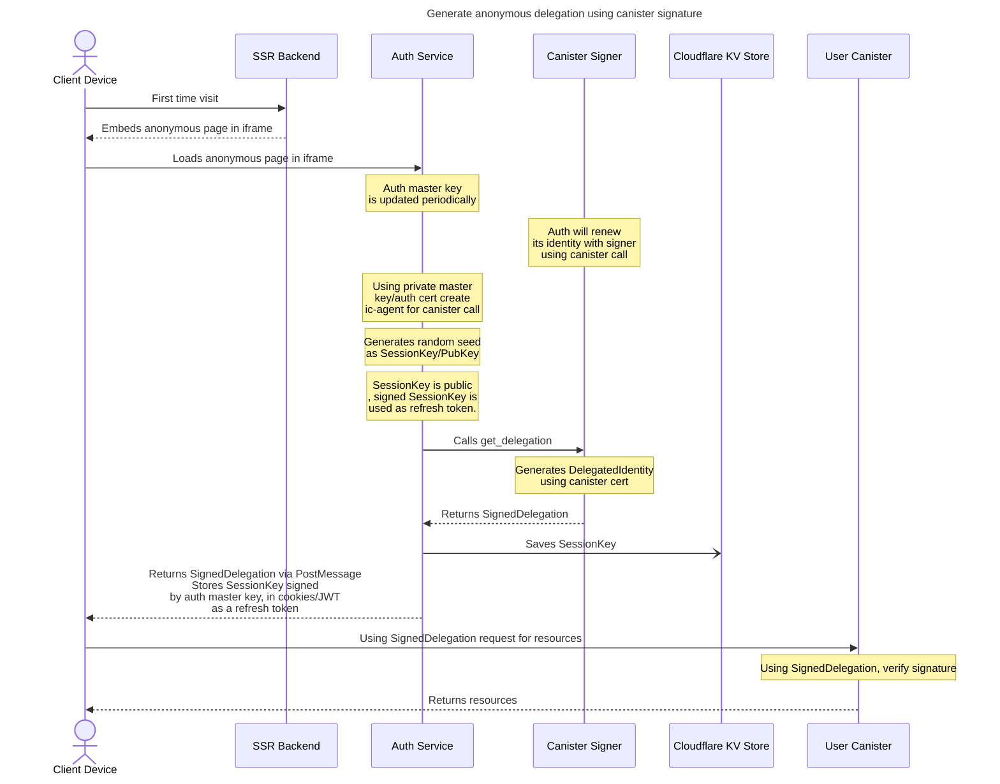

# Anonymous delegation using Canister Signature

```mermaid
---
title: Generate anonymous delegation using canister signature
---
sequenceDiagram
    actor client as Client Device
    participant ssr as SSR Backend
    participant auth as Auth Service
    participant signer as Canister Signer
    participant kv as Cloudflare KV Store
    participant canister as User Canister
    client->>ssr: First time visit
    ssr-->>client: Embeds anonymous page in iframe
    client->>auth: Loads anonymous page in iframe
    Note over auth: Auth master key<br/> is updated periodically
    Note over signer: Auth will renew<br/> its identity with signer<br/> using canister call
    Note over auth: Using private master<br/> key/auth cert create<br/> ic-agent for canister call
    Note over auth: Generates random seed<br/> as SessionKey/PubKey
    Note over auth: SessionKey is public<br/>, signed SessionKey is<br/> used as refresh token.
    auth->>signer: Calls get_delegation
    Note over signer: Generates DelegatedIdentity<br/> using canister cert
    signer-->>auth: Returns SignedDelegation
    auth-)kv: Saves SessionKey
    auth-->>client: Returns SignedDelegation via PostMessage<br/> Stores SessionKey signed<br/> by auth master key, in cookies/JWT<br/> as a refresh token
    client->>canister: Using SignedDelegation request for resources
    Note over canister: Using SignedDelegation, verify signature
    canister-->>client: Returns resources
```
