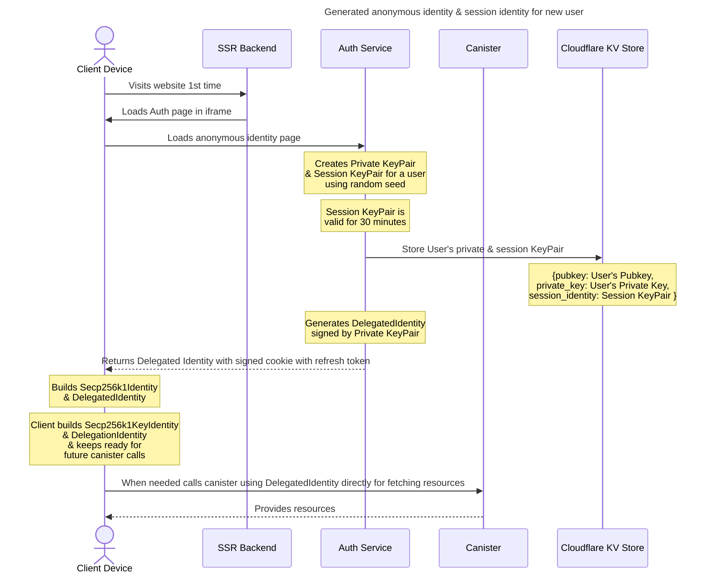

# Anonymous Identity

```mermaid
---
title: Generated anonymous identity & session identity for new user
---
sequenceDiagram
    actor client as Client Device
    participant ssr as SSR Backend
    participant auth as Auth Service
    participant canister as Canister
    participant kv as Cloudflare KV Store
    client->>ssr: Visits website 1st time
    ssr->>client: Loads Auth page in iframe
    client->>auth: Loads anonymous identity page
    Note over auth: Creates Private KeyPair <br/> & Session KeyPair for a user <br/> using random seed
    Note over auth: Session KeyPair is <br/> valid for 30 minutes
    auth->>kv: Store User's private & session KeyPair
    Note over kv: {pubkey: User's Pubkey, <br/> private_key: User's Private Key, <br/> session_identity: Session KeyPair }
    Note over auth: Generates DelegatedIdentity <br/> signed by Private KeyPair
    auth-->>client: Returns Delegated Identity with signed cookie with refresh token
    Note over client: Builds Secp256k1Identity <br/> & DelegatedIdentity
    Note over client: Client builds Secp256k1KeyIdentity <br/> & DelegationIdentity <br/> & keeps ready for <br/> future canister calls
    client->>canister: When needed calls canister using DelegatedIdentity directly for fetching resources
    canister-->>client: Provides resources
```
