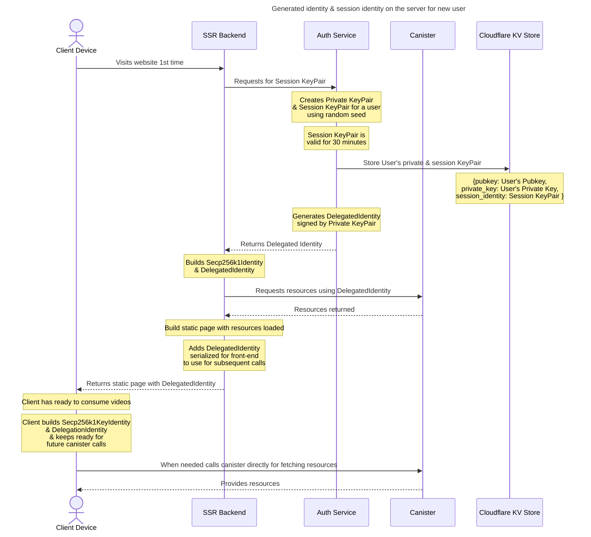
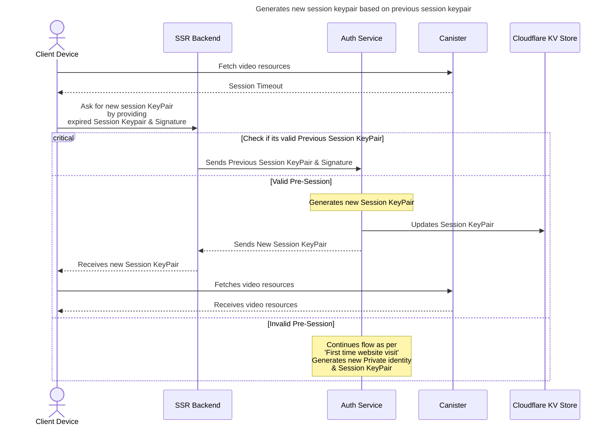
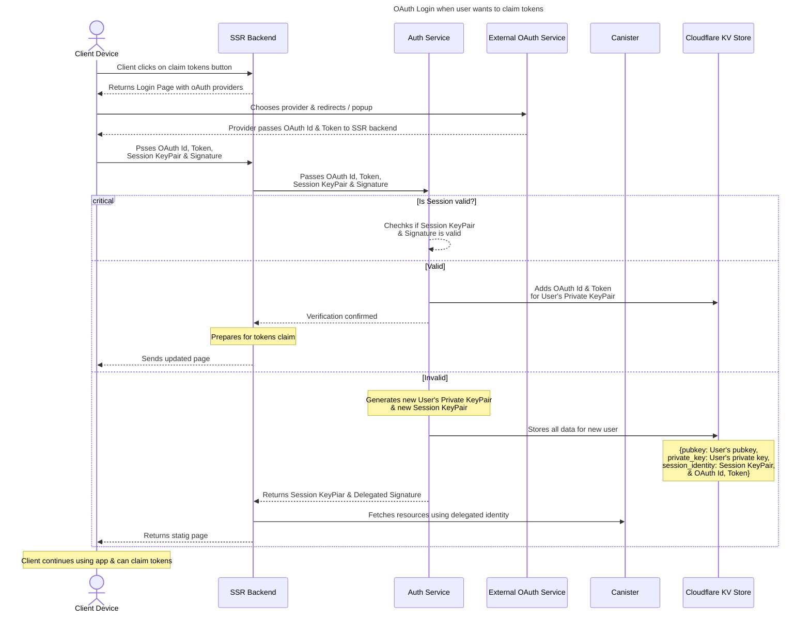
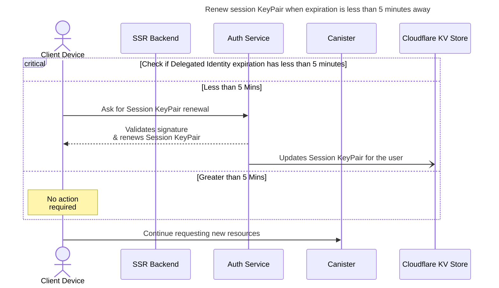

# Client Canister authentication Flow

## No OAuth verification flow
### Generated identity & session identity on the server for new user

### Client flow when session expires, visits after 30 minutes

## OAuth Login when user wants to claim tokens

### Renew Session KeyPair before expiry on client

