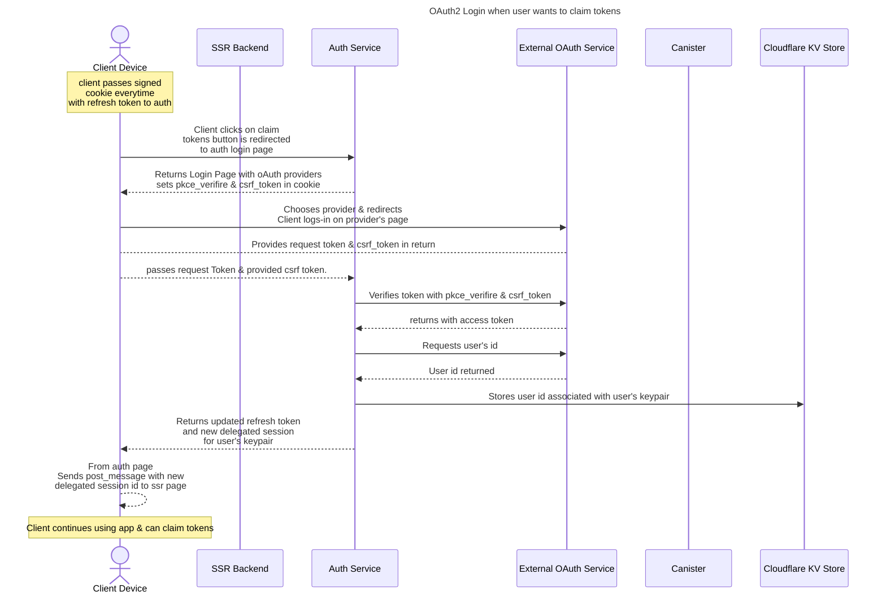

# OAuth2 Login

## Example provider - Google

```mermaid
---
title: OAuth2 Login when user wants to claim tokens
---
sequenceDiagram
    actor client as Client Device
    participant ssr as SSR Backend
    participant auth as Auth Service
    participant ext_auth as External OAuth Service
    participant canister as Canister
    participant kv as Cloudflare KV Store
	Note over client: client passes signed<br /> cookie everytime<br/> with refresh token to auth
    client->>auth: Client clicks on claim<br /> tokens button is redirected<br /> to auth login page
    auth-->>client: Returns Login Page with oAuth providers<br /> sets pkce_verifire & csrf_token in cookie
    client->>ext_auth: Chooses provider & redirects<br /> Client logs-in on provider's page
    ext_auth-->client: Provides request token & csrf_token in return
    client-->>auth: passes request Token & provided csrf token.
    auth->>ext_auth: Verifies token with pkce_verifire & csrf_token
    ext_auth-->>auth: returns with access token
    auth->>ext_auth: Requests user's id
    ext_auth-->>auth: User id returned
    auth->>kv: Stores user id associated with user's keypair
    auth-->>client: Returns updated refresh token<br /> and new delegated session<br /> for user's keypair
    client-->>client: From auth page<br /> Sends post_message with new<br /> delegated session id to ssr page
    Note over client: Client continues using app & can claim tokens
```
